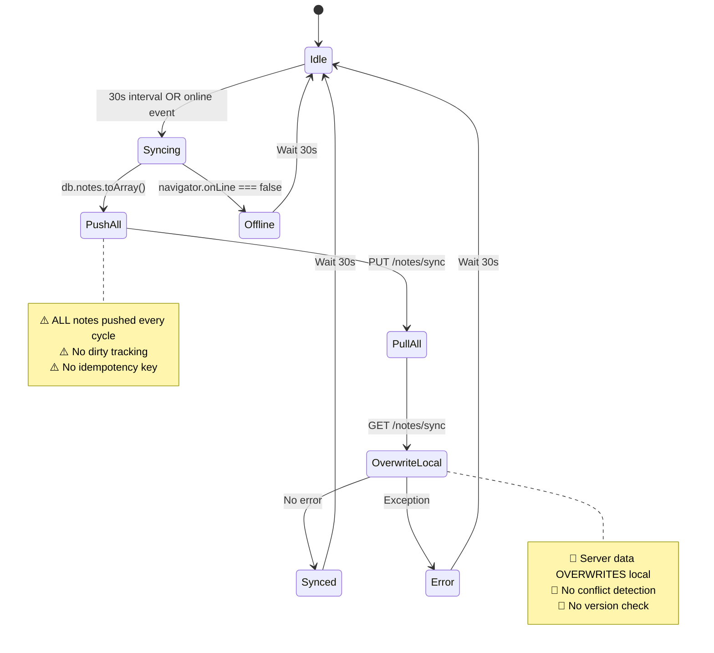
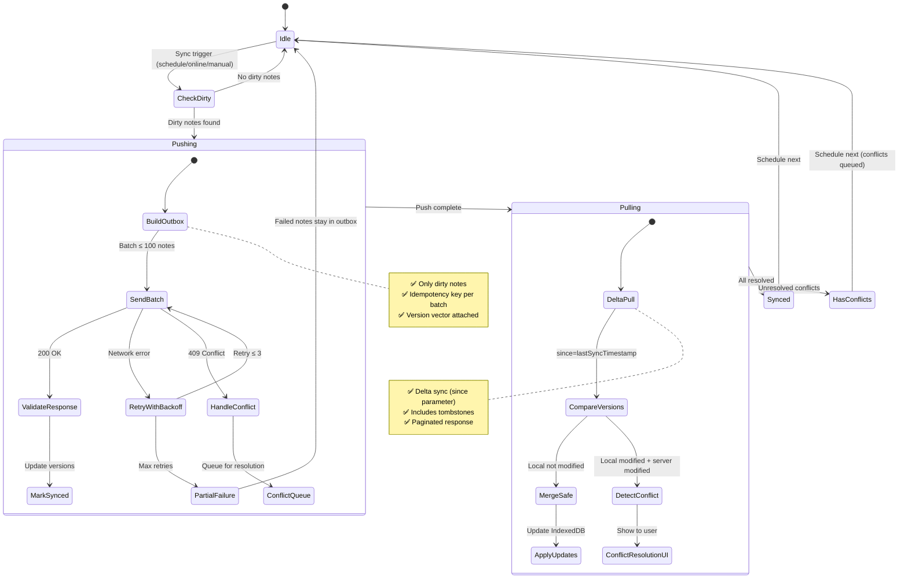
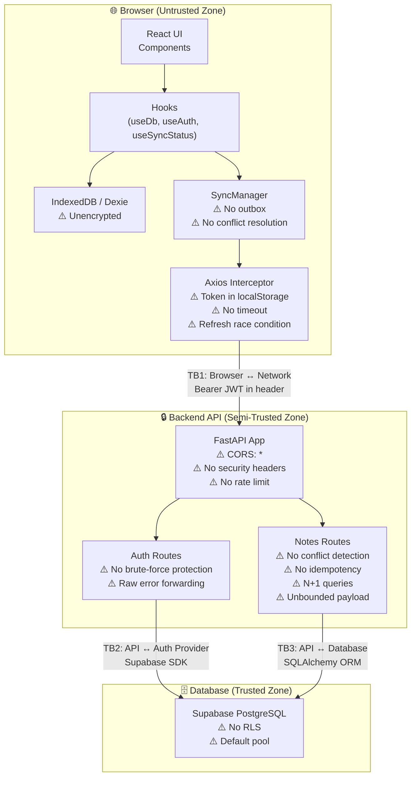

# 🔬 Sync Operation Audit Plan — `notes-pwa`

> **Date**: 2026-08-07 · **Audited By**: 3 specialized sub-agents (Frontend Sync, Backend Sync, Security Threat Modeler)
> **Scope**: Full-stack sync operations, data flow, state consistency, subsystem dependencies
> **Mode**: READ-ONLY static analysis — zero code modifications

---

## 1. Executive Summary & Risk Matrix

### Overall Assessment: 🔴 BLOCKED — Requires Redesign Before Production

The sync subsystem has **fundamental architectural gaps** that make it unsuitable for multi-device usage, the primary purpose of a sync system. The codebase operates as a **"dump-and-overwrite" system** rather than a true sync engine, with no conflict resolution, no dirty tracking, no idempotency, and no incremental sync.

Security posture is **critically deficient** with wide-open CORS, tokens in `localStorage`, zero rate limiting, and no security headers.

### Risk Taxonomy

| Severity | Count | Categories |
|---|---|---|
| 🔴 **CRITICAL** | 8 | Data loss, session hijack, DoS, CORS bypass |
| 🟠 **HIGH** | 14 | N+1 queries, no retry, no offline queue, unencrypted IndexedDB, auth brute-force |
| 🟡 **MEDIUM** | 10 | Monolithic components, no audit trail, IDOR, error leakage |
| 🟢 **LOW** | 5 | Timezone bugs, logging, schema versioning |

### Top 5 Existential Risks

| # | Risk | Impact | Probability |
|---|---|---|---|
| 1 | **Silent data loss on multi-device sync** | Users lose work permanently | Near-certain |
| 2 | **Full account takeover via XSS + localStorage tokens** | Complete compromise | High (one XSS = game over) |
| 3 | **Server DoS via unbounded batch sync** | Full service outage | High (trivial to exploit) |
| 4 | **CORS misconfiguration enables CSRF** | Authenticated API abuse | High |
| 5 | **No rate limiting enables credential stuffing** | Mass account compromise | High |

---

## 2. Technical Error & Architecture Breakdown

### 2.1 Sync Engine — Frontend (`software-architecture` · `event-sourcing-architect`)

#### FINDING F-01: No Outbox/Mutation Queue 🔴 CRITICAL
- **Location**: [`syncManager.js`](file:///C:/Users/Touqeer%20Hamdani/Desktop/Projects/notes-pwa/frontend/src/lib/syncManager.js) — lines 19-32
- **Skill**: `event-sourcing-architect`
- **Flaw**: No outbox pattern. All notes pushed every 30-second cycle via `db.notes.toArray()` → `PUT /notes/sync`. No dirty tracking (`isDirty` flag), no mutation ordering, no deduplication.
- **Impact**: Wasteful O(n) bandwidth per sync; edits between cycles are orphaned if app closes; no idempotency guarantee on replay.
- **Remediation**: Add `syncStatus` enum field to Dexie schema (`pending | synced | conflict`). Track mutations in an `outbox` table with sequence numbers. Push only dirty records. Use `workbox-background-sync` for SW-level queueing.

#### FINDING F-02: Server-Wins-Always Conflict Resolution 🔴 CRITICAL
- **Location**: [`syncManager.js`](file:///C:/Users/Touqeer%20Hamdani/Desktop/Projects/notes-pwa/frontend/src/lib/syncManager.js) — lines 44-68
- **Skill**: `event-sourcing-architect`
- **Flaw**: Pull phase unconditionally overwrites local data: `db.notes.update(serverNote.id, { ...serverNote })`. No `updated_at` comparison, no version vector, no user prompt for conflicts.
- **Impact**: **Silent data loss**. Local edits made between push and pull are destroyed. Multi-device usage is broken.
- **Remediation**: Implement LWW (Last-Write-Wins) with `updated_at` comparison as minimum. For text notes, consider operational transforms or CRDT (e.g., Yjs/Automerge). Add conflict resolution UI for manual merge.

#### FINDING F-03: No Conflict Detection Mechanism 🔴 CRITICAL
- **Location**: System-wide (both [`syncManager.js`](file:///C:/Users/Touqeer%20Hamdani/Desktop/Projects/notes-pwa/frontend/src/lib/syncManager.js) and [`notes.py`](file:///C:/Users/Touqeer%20Hamdani/Desktop/Projects/notes-pwa/backend/routes/notes.py))
- **Skill**: `event-sourcing-architect`
- **Flaw**: No version counters, vector clocks, Lamport timestamps, or content hashing. Concurrent edits from multiple devices produce undefined results.
- **Impact**: **Silent data corruption** on any multi-device workflow.
- **Remediation**: Add `version` integer column to `Note` model. Client sends version with each edit. Server rejects writes where `client_version != server_version` (409 Conflict). Client must re-pull and re-apply.

#### FINDING F-04: No HTTP Timeout 🟠 HIGH
- **Location**: [`axios.js`](file:///C:/Users/Touqeer%20Hamdani/Desktop/Projects/notes-pwa/frontend/src/lib/axios.js) — line 6
- **Skill**: `software-architecture`
- **Flaw**: Axios instance created with no `timeout` property. Requests hang indefinitely on slow/dead connections.
- **Impact**: App appears frozen; sync status never resolves; user cannot tell if offline.
- **Remediation**: Add `timeout: 10000` to Axios config. Use `AbortController` for cancellable requests.

#### FINDING F-05: No Retry with Backoff 🟠 HIGH
- **Location**: [`syncManager.js`](file:///C:/Users/Touqeer%20Hamdani/Desktop/Projects/notes-pwa/frontend/src/lib/syncManager.js) — entire file
- **Skill**: `event-sourcing-architect`
- **Flaw**: Failed syncs set status to `error` and wait for next 30s interval. No exponential backoff, no jitter, no retry mechanism.
- **Impact**: Delayed recovery after transient failures; thundering herd on reconnect.
- **Remediation**: Use `cockatiel` or `p-retry` library. Implement exponential backoff with jitter: `min(cap, base * 2^attempt) + random_jitter`.

#### FINDING F-06: No Background Sync (Service Worker) 🟠 HIGH
- **Location**: [`vite.config.js`](file:///C:/Users/Touqeer%20Hamdani/Desktop/Projects/notes-pwa/frontend/vite.config.js) — lines 22-38
- **Skill**: `event-sourcing-architect`
- **Flaw**: PWA config uses `generateSW` with `NetworkFirst` runtime caching for GET only. No `workbox-background-sync` plugin. No `sync` event handler in Service Worker.
- **Impact**: Offline mutations lost if app closes before next sync interval fires.
- **Remediation**: Add `workbox-background-sync` to queue failed POST/PUT. Register a named sync queue: `registerRoute(syncRoute, new NetworkOnly({ plugins: [bgSyncPlugin] }), 'PUT')`.

#### FINDING F-07: Sync Orchestration in UI Component 🟠 HIGH
- **Location**: [`HomePage.jsx`](file:///C:/Users/Touqeer%20Hamdani/Desktop/Projects/notes-pwa/frontend/src/pages/HomePage.jsx) — lines 74-88
- **Skill**: `software-architecture`
- **Flaw**: `setInterval`, `online` event listener, and sync triggering embedded in React component lifecycle.
- **Impact**: Untestable; sync timing coupled to React rendering; no way to unit test sync scheduling.
- **Remediation**: Extract to `SyncScheduler` class or adopt `@tanstack/query` with `refetchInterval`.

#### FINDING F-08: Monolithic Components 🟡 MEDIUM
- **Location**: [`Preview.jsx`](file:///C:/Users/Touqeer%20Hamdani/Desktop/Projects/notes-pwa/frontend/src/components/Preview.jsx) (~530 lines), [`Folder.jsx`](file:///C:/Users/Touqeer%20Hamdani/Desktop/Projects/notes-pwa/frontend/src/components/Folder.jsx) (~370 lines), [`List.jsx`](file:///C:/Users/Touqeer%20Hamdani/Desktop/Projects/notes-pwa/frontend/src/components/List.jsx) (~310 lines)
- **Skill**: `software-architecture`
- **Flaw**: All three exceed 200-line threshold. `Preview.jsx` is 530+ lines with editing, formatting, state, and rendering in one function.
- **Impact**: Unmaintainable; any change risks regression; impossible to unit test.
- **Remediation**: Decompose `Preview.jsx` into `NoteEditor`, `NoteToolbar`, `NotePreview`, `useNoteState`. Apply same pattern to `Folder.jsx` and `List.jsx`.

---

### 2.2 Sync Engine — Backend (`software-architecture` · `event-sourcing-architect` · `api-security-testing`)

#### FINDING B-01: No Server-Side Conflict Detection 🔴 CRITICAL
- **Location**: [`notes.py`](file:///C:/Users/Touqeer%20Hamdani/Desktop/Projects/notes-pwa/backend/routes/notes.py) — lines 155-170
- **Skill**: `event-sourcing-architect`
- **Flaw**: Batch sync upserts client data without checking `updated_at` or version. `onupdate=datetime.utcnow` fires on server side, reflecting sync time, not edit time.
- **Impact**: **Permanent data loss** on multi-device usage. Last push wins silently.
- **Remediation**: Add `version` column. Reject writes where `client_version != server_version` with `409 Conflict`. Return new version in response.

#### FINDING B-02: No Idempotency on Sync Endpoint 🔴 CRITICAL
- **Location**: [`notes.py`](file:///C:/Users/Touqeer%20Hamdani/Desktop/Projects/notes-pwa/backend/routes/notes.py) — lines 140-190
- **Skill**: `event-sourcing-architect`
- **Flaw**: No `Idempotency-Key` header support. Replayed/retried requests re-process all mutations.
- **Impact**: Network timeout + client retry = duplicate operations, data corruption.
- **Remediation**: Accept `Idempotency-Key` header. Store processed keys in Redis/DB with 24h TTL. Return cached response for duplicate keys.

#### FINDING B-03: N+1 Query in Batch Sync 🟠 HIGH
- **Location**: [`notes.py`](file:///C:/Users/Touqeer%20Hamdani/Desktop/Projects/notes-pwa/backend/routes/notes.py) — line ~155
- **Skill**: `software-architecture`
- **Flaw**: Each note in batch triggers individual `SELECT` to check existence. 100 notes = 100 queries.
- **Impact**: Performance degradation at scale; DB connection pool exhaustion.
- **Remediation**: Batch-fetch with `WHERE id IN (...)`. Use PostgreSQL `INSERT ... ON CONFLICT DO UPDATE` for single-query upsert.

#### FINDING B-04: Zero Rate Limiting 🟠 HIGH
- **Location**: All routes in [`auth.py`](file:///C:/Users/Touqeer%20Hamdani/Desktop/Projects/notes-pwa/backend/routes/auth.py) and [`notes.py`](file:///C:/Users/Touqeer%20Hamdani/Desktop/Projects/notes-pwa/backend/routes/notes.py)
- **Skill**: `api-security-testing`
- **Flaw**: No rate limiting library installed. Login, signup, password reset, sync endpoints all unprotected.
- **Impact**: Brute-force attacks, credential stuffing, email flooding, DoS.
- **Remediation**: Add `slowapi` with per-endpoint limits: login=5/min, signup=3/min, sync=10/min, reset-password=3/hour.

#### FINDING B-05: Unbounded Batch Sync Payload 🟠 HIGH
- **Location**: [`notes.py`](file:///C:/Users/Touqeer%20Hamdani/Desktop/Projects/notes-pwa/backend/routes/notes.py) — line 145
- **Skill**: `api-security-testing`
- **Flaw**: No max array size, no max content length per note, no request body size limit.
- **Impact**: Memory exhaustion → server crash → denial of service.
- **Remediation**: `MAX_BATCH_SIZE = 100`; max content per note = 1MB; add request body size limit middleware (e.g., 10MB).

#### FINDING B-06: No Delta/Incremental Sync 🟠 HIGH
- **Location**: [`notes.py`](file:///C:/Users/Touqeer%20Hamdani/Desktop/Projects/notes-pwa/backend/routes/notes.py) — lines 195-210
- **Skill**: `event-sourcing-architect`
- **Flaw**: `GET /notes/sync` returns ALL notes every time. No `since` parameter for delta sync.
- **Impact**: Bandwidth waste; poor mobile performance; sync time grows linearly with data.
- **Remediation**: Add `?since=<ISO8601>` parameter. Return only notes with `updated_at > since`. Include tombstones for deleted notes.

#### FINDING B-07: No Tombstones for Deletes 🟠 HIGH
- **Location**: [`notes.py`](file:///C:/Users/Touqeer%20Hamdani/Desktop/Projects/notes-pwa/backend/routes/notes.py) — delete endpoint + sync
- **Skill**: `event-sourcing-architect`
- **Flaw**: Soft-deleted notes may reappear when another device syncs them back (ghost resurrection).
- **Impact**: Delete operations not durable across devices.
- **Remediation**: Add `is_deleted` boolean + `deleted_at` timestamp. Include deleted note IDs in sync response. Client deletes locally on pull.

#### FINDING B-08: No Partial Failure Handling 🟠 HIGH
- **Location**: [`notes.py`](file:///C:/Users/Touqeer%20Hamdani/Desktop/Projects/notes-pwa/backend/routes/notes.py) — lines 140-190
- **Skill**: `event-sourcing-architect`
- **Flaw**: Single malformed note crashes entire batch. Client receives no per-note status.
- **Impact**: One bad note blocks all others from syncing.
- **Remediation**: Process notes individually with try/except per note. Return `{ succeeded: [...], failed: [{id, error}] }`.

#### FINDING B-09: No Connection Pool Tuning 🟠 HIGH
- **Location**: [`db.py`](file:///C:/Users/Touqeer%20Hamdani/Desktop/Projects/notes-pwa/backend/db.py) — lines 30-40
- **Skill**: `software-architecture`
- **Flaw**: Default SQLAlchemy pool settings. No `pool_size`, `max_overflow`, `pool_timeout`, or `statement_timeout`.
- **Impact**: Connection exhaustion under load; unbounded query time.
- **Remediation**: `pool_size=10, max_overflow=20, pool_timeout=30`; add `statement_timeout=30000` (30s).

#### FINDING B-10: No Pydantic Schemas 🟡 MEDIUM
- **Location**: All routes — `request.json()` used instead of typed models
- **Skill**: `software-architecture`
- **Flaw**: Raw JSON parsing with no automatic validation, no docs, no type safety.
- **Impact**: No automatic validation; OpenAPI docs incomplete; type errors at runtime.
- **Remediation**: Define Pydantic `BaseModel` schemas for every endpoint request/response.

---

### 2.3 Security (`threat-modeling-expert` · `007` · `security-auditor`)

#### FINDING S-01: CORS Wide Open 🔴 CRITICAL
- **Location**: [`app.py`](file:///C:/Users/Touqeer%20Hamdani/Desktop/Projects/notes-pwa/backend/app.py) — line 12
- **Skill**: `007`
- **Flaw**: `allow_origins=["*"]` with `allow_credentials=True`. Any origin can make authenticated requests.
- **Attack**: Malicious website makes API calls on behalf of logged-in user.
- **Remediation**: Set `allow_origins` to specific frontend domain(s): `["https://your-app.com"]`.

#### FINDING S-02: JWT in localStorage 🔴 CRITICAL
- **Location**: [`axios.js`](file:///C:/Users/Touqeer%20Hamdani/Desktop/Projects/notes-pwa/frontend/src/lib/axios.js) — line 9
- **Skill**: `threat-modeling-expert`
- **Flaw**: Access token stored in `localStorage`, accessible to any JavaScript on the page.
- **Attack**: XSS → read `localStorage` → steal tokens → full account takeover.
- **Remediation**: Migrate to httpOnly cookie-based auth or in-memory token with Supabase `getSession()`.

#### FINDING S-03: No Rate Limiting on Auth 🔴 CRITICAL
- **Location**: [`auth.py`](file:///C:/Users/Touqeer%20Hamdani/Desktop/Projects/notes-pwa/backend/routes/auth.py) — lines 56-70
- **Skill**: `007`
- **Flaw**: Zero brute-force protection on login. No account lockout, no CAPTCHA.
- **Attack**: Automated credential stuffing at thousands of attempts/minute.
- **Remediation**: `slowapi`: 5 attempts/minute per IP for login; progressive lockout after 10 failures.

#### FINDING S-04: IndexedDB Not Cleared on Logout 🟠 HIGH
- **Location**: [`useAuth.js`](file:///C:/Users/Touqeer%20Hamdani/Desktop/Projects/notes-pwa/frontend/src/hooks/useAuth.js)
- **Skill**: `security-auditor`
- **Flaw**: Logout clears tokens from `localStorage` but does NOT clear IndexedDB. All cached notes remain.
- **Attack**: Shared computer — next user reads previous user's notes via DevTools.
- **Remediation**: Call `db.notes.clear()` and `db.delete()` in logout function.

#### FINDING S-05: Unencrypted IndexedDB 🟠 HIGH
- **Location**: [`db.js`](file:///C:/Users/Touqeer%20Hamdani/Desktop/Projects/notes-pwa/frontend/src/lib/db.js) — lines 1-18
- **Skill**: `threat-modeling-expert`
- **Flaw**: All note content stored in plaintext in IndexedDB. No encryption-at-rest.
- **Attack**: Physical access, forensic recovery, malicious extension → all notes readable.
- **Remediation**: Use `dexie-encrypted` addon or Web Crypto API for client-side encryption.

#### FINDING S-06: No Security Headers 🟠 HIGH
- **Location**: [`app.py`](file:///C:/Users/Touqeer%20Hamdani/Desktop/Projects/notes-pwa/backend/app.py)
- **Skill**: `007`
- **Flaw**: No CSP, HSTS, X-Frame-Options, X-Content-Type-Options, Referrer-Policy.
- **Attack**: XSS, clickjacking, downgrade attacks, MIME sniffing.
- **Remediation**: Add security headers middleware with strict CSP.

#### FINDING S-07: Token Refresh Race Condition 🟠 HIGH
- **Location**: [`axios.js`](file:///C:/Users/Touqeer%20Hamdani/Desktop/Projects/notes-pwa/frontend/src/lib/axios.js) — lines 15-50
- **Skill**: `threat-modeling-expert`
- **Flaw**: Concurrent 401 responses trigger multiple `refreshSession()` calls. Token rotation may invalidate concurrent refreshes.
- **Attack**: Heavy sync traffic with expiring token → cascade of failed refreshes → forced logout → data loss.
- **Remediation**: Implement refresh mutex: single promise that all 401 retries await. Use `axios-auth-refresh` library.

#### FINDING S-08: Raw Error Forwarding 🟠 HIGH
- **Location**: [`auth.py`](file:///C:/Users/Touqeer%20Hamdani/Desktop/Projects/notes-pwa/backend/routes/auth.py) — lines ~45, ~70, ~90
- **Skill**: `security-auditor`
- **Flaw**: `raise HTTPException(status_code=400, detail=str(e))` forwards raw Supabase errors.
- **Attack**: Malformed requests to extract DB schema info, internal state.
- **Remediation**: Standardized error responses: `{"error": "generic_message", "code": "AUTH_001"}`.

#### FINDING S-09: No Auth Event Logging 🟡 MEDIUM
- **Location**: [`auth.py`](file:///C:/Users/Touqeer%20Hamdani/Desktop/Projects/notes-pwa/backend/routes/auth.py)
- **Skill**: `007`
- **Flaw**: Login, logout, signup, password changes not logged.
- **Attack**: Cannot detect account compromise or investigate incidents.
- **Remediation**: Log all auth events with timestamp, IP, user-agent, result, and correlation ID.

#### FINDING S-10: No Row-Level Security 🟡 MEDIUM
- **Location**: [`db.py`](file:///C:/Users/Touqeer%20Hamdani/Desktop/Projects/notes-pwa/backend/db.py) + Supabase config
- **Skill**: `security-auditor`
- **Flaw**: No Supabase RLS enabled. Application-level `user_id` filtering is the only access control.
- **Attack**: If service role key leaks or app-level filter has a bug → full cross-tenant data access.
- **Remediation**: Enable Supabase RLS policies as defense-in-depth.

---

## 3. Sync State Machine & Flow Diagrams

### 3.1 Current Flow (Flawed)

### 3.2 Target Flow (Resilient)

### 3.3 Data Flow Diagram (Trust Boundaries)

---

## 4. Agile Sprint Backlog

### Sprint 0: Critical Security Hardening (1 week)
> **Goal**: Eliminate exploitable attack vectors before any other work.

| # | Task | Finding | Priority | Points |
|---|---|---|---|---|
| 0.1 | Fix CORS: set `allow_origins` to specific frontend domain | S-01 | 🔴 P0 | 1 |
| 0.2 | Add `slowapi` rate limiting to all auth endpoints | B-04, S-03 | 🔴 P0 | 2 |
| 0.3 | Add security headers middleware (CSP, HSTS, X-Frame-Options) | S-06 | 🔴 P0 | 2 |
| 0.4 | Add request body size limit middleware (10MB max) | B-05 | 🔴 P0 | 1 |
| 0.5 | Add batch sync size limit (`MAX_BATCH_SIZE = 100`) | B-05 | 🔴 P0 | 1 |
| 0.6 | Standardize error responses — no raw Supabase errors | S-08 | 🟠 P1 | 2 |
| 0.7 | Add auth event logging (login/logout/signup) | S-09 | 🟠 P1 | 2 |
| **Total** | | | | **11 pts** |

### Sprint 1: Auth & Data-at-Rest (1 week)
> **Goal**: Secure token handling and local data protection.

| # | Task | Finding | Priority | Points |
|---|---|---|---|---|
| 1.1 | Migrate token storage from `localStorage` to Supabase `getSession()` in-memory | S-02 | 🔴 P0 | 5 |
| 1.2 | Implement token refresh mutex (single refresh promise) | S-07 | 🟠 P1 | 3 |
| 1.3 | Clear IndexedDB on logout (`db.notes.clear()`) | S-04 | 🟠 P1 | 1 |
| 1.4 | Add HTTP timeout to Axios config (`timeout: 10000`) | F-04 | 🟠 P1 | 1 |
| 1.5 | Evaluate `dexie-encrypted` for IndexedDB encryption-at-rest | S-05 | 🟡 P2 | 3 |
| **Total** | | | | **13 pts** |

### Sprint 2: Sync Engine Redesign — Core (2 weeks)
> **Goal**: Replace dump-and-overwrite with proper sync protocol.

| # | Task | Finding | Priority | Points |
|---|---|---|---|---|
| 2.1 | Add `version` integer column to `Note` model + Alembic migration | F-03, B-01 | 🔴 P0 | 3 |
| 2.2 | Add `is_dirty` boolean to Dexie schema for dirty tracking | F-01 | 🔴 P0 | 2 |
| 2.3 | Implement outbox table in Dexie (`syncOutbox`) with sequence numbers | F-01 | 🔴 P0 | 5 |
| 2.4 | Implement optimistic locking on server: reject stale writes with 409 | B-01 | 🔴 P0 | 5 |
| 2.5 | Add `Idempotency-Key` header support on server | B-02 | 🔴 P0 | 5 |
| 2.6 | Convert batch sync to `INSERT ... ON CONFLICT DO UPDATE` | B-03 | 🟠 P1 | 3 |
| 2.7 | Add `?since=<timestamp>` delta sync parameter to `GET /notes/sync` | B-06 | 🟠 P1 | 3 |
| 2.8 | Implement tombstones for deleted notes | B-07 | 🟠 P1 | 3 |
| 2.9 | Add per-note error handling in batch sync | B-08 | 🟠 P1 | 3 |
| **Total** | | | | **32 pts** |

### Sprint 3: Sync Engine Redesign — Client (1 week)
> **Goal**: Client-side sync resilience.

| # | Task | Finding | Priority | Points |
|---|---|---|---|---|
| 3.1 | Implement LWW conflict resolution with `updated_at` comparison | F-02 | 🔴 P0 | 5 |
| 3.2 | Add retry with exponential backoff + jitter (use `p-retry`) | F-05 | 🟠 P1 | 3 |
| 3.3 | Extract sync orchestration from `HomePage.jsx` to `SyncScheduler` | F-07 | 🟠 P1 | 3 |
| 3.4 | Add `workbox-background-sync` for offline mutation queueing | F-06 | 🟠 P1 | 5 |
| 3.5 | Add `offline` event listener to pause sync and show degraded UI | F-08 (related) | 🟡 P2 | 2 |
| 3.6 | Add correlation IDs to sync requests | F-08 (related) | 🟡 P2 | 2 |
| **Total** | | | | **20 pts** |

### Sprint 4: Backend Quality & Observability (1 week)
> **Goal**: Clean architecture and production readiness.

| # | Task | Finding | Priority | Points |
|---|---|---|---|---|
| 4.1 | Add Pydantic request/response schemas for all endpoints | B-10 | 🟡 P2 | 5 |
| 4.2 | Extract sync logic to `SyncService` (service layer) | B-10 (related) | 🟡 P2 | 5 |
| 4.3 | Configure connection pool: `pool_size=10, max_overflow=20` | B-09 | 🟡 P2 | 2 |
| 4.4 | Enable Supabase RLS as defense-in-depth | S-10 | 🟡 P2 | 3 |
| 4.5 | Migrate to `structlog` for structured logging | B-10 (related) | 🟢 P3 | 3 |
| 4.6 | Fix `datetime.utcnow` → `datetime.now(UTC)` | B (related) | 🟢 P3 | 1 |
| **Total** | | | | **19 pts** |

### Sprint 5: Frontend Decomposition (1 week)
> **Goal**: Code quality and maintainability.

| # | Task | Finding | Priority | Points |
|---|---|---|---|---|
| 5.1 | Decompose `Preview.jsx` into `NoteEditor`, `NoteToolbar`, `useNoteState` | F-08 | 🟡 P2 | 8 |
| 5.2 | Decompose `Folder.jsx` into smaller components + hooks | F-08 | 🟡 P2 | 5 |
| 5.3 | Decompose `List.jsx` — extract search/filter to hook | F-08 | 🟡 P2 | 3 |
| 5.4 | Replace custom sync status with `@tanstack/query` or `xstate` state machine | F-08 (related) | 🟢 P3 | 5 |
| **Total** | | | | **21 pts** |

### Velocity Summary

| Sprint | Duration | Points | Focus |
|---|---|---|---|
| Sprint 0 | 1 week | 11 | 🔴 Security hardening |
| Sprint 1 | 1 week | 13 | 🔴 Auth & data protection |
| Sprint 2 | 2 weeks | 32 | 🔴 Sync protocol redesign |
| Sprint 3 | 1 week | 20 | 🟠 Client sync resilience |
| Sprint 4 | 1 week | 19 | 🟡 Backend quality |
| Sprint 5 | 1 week | 21 | 🟡 Frontend decomposition |
| **Total** | **7 weeks** | **116 pts** | |

---

> [!CAUTION]
> **Sprints 0-2 are blocking for production.** The system should NOT handle real user data until conflict detection (Sprint 2) and security hardening (Sprint 0) are complete. Data loss is near-certain under current architecture.

> [!TIP]
> **Quick wins for Sprint 0**: CORS fix (S-01), rate limiting (B-04), and body size limits (B-05) can each be done in under an hour and eliminate the most exploitable attack vectors.
